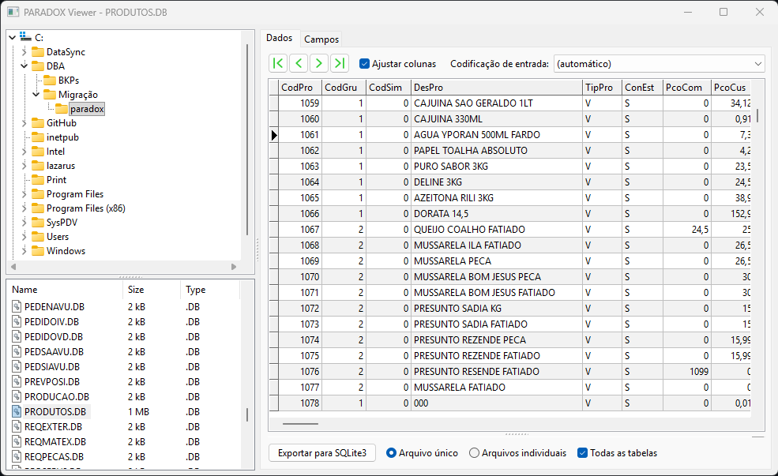

# 🗄️ ParadoxViewer

## 📜 Introdução

O **ParadoxViewer** é uma aplicação desktop somente leitura para visualização de arquivos de banco de dados **Paradox** — um formato legado amplamente utilizado em sistemas dos anos 80 e 90. Com ele, é possível navegar pelo sistema de arquivos, inspecionar registros e estrutura de campos, e exportar os dados para **SQLite3** para uso em sistemas modernos.

> **Pronto para usar**: o repositório já inclui o executável compilado em `dist/pxView.exe`. Basta clonar e executar — nenhuma instalação adicional é necessária (`dist/sqlite3.dll` já está incluída na mesma pasta para exportação).



---

## ✨ Funcionalidades

- **Visualização de dados**: Exibe os registros em um `DBGrid` com navegação via `DBNavigator` (primeiro, anterior, próximo, último)
- **Estrutura de campos**: Listagem completa de todos os campos da tabela com índice, nome, tipo, tamanho e obrigatoriedade
- **Exportação para SQLite3**: Exporta a tabela aberta para um arquivo `.sqlite` individual ou em um arquivo combinado com o nome da pasta
- **Exportação em lote**: Exporta todos os arquivos `.db` da pasta de uma vez, com log detalhado em `pxView.log`
- **Suporte a BLOB**: Exibe campos do tipo `Memo` (texto) e `Graphic` (imagem) em painéis dedicados, atualizados conforme o registro ativo
- **Codificação de entrada**: Suporte a dezenas de páginas de código (CP1250, CP1252, ISO-8859, KOI8, etc.) com detecção automática
- **Ajustar colunas**: Opção para ajustar a largura das colunas ao conteúdo
- **Argumento via linha de comando**: Aceita caminho de arquivo ou diretório como argumento ao iniciar, abrindo diretamente o arquivo ou navegando para a pasta
- **Somente leitura**: Nenhuma alteração é permitida nos arquivos Paradox originais

---

## 🏗️ Arquitetura

O projeto é uma aplicação desktop em **Free Pascal + Lazarus LCL**, sem dependências externas além da `sqlite3.dll`. O código-fonte é organizado em units por responsabilidade, com métodos grandes extraídos para arquivos `.inc` incluídos via `{$I}`:

```
ParadoxViewer/
├── pxView.lpi              # Projeto Lazarus
├── pxView.lpr              # Entry point — inicialização da aplicação
├── pxView.res              # Resources compilados (ícone embutido)
│
├── dist/                   # Saída de compilação (gerada automaticamente)
│   ├── pxView.exe          # Executável compilado
│   ├── sqlite3.dll         # Dependência de runtime para exportação SQLite3
│   └── pxView.log          # Log gerado na exportação em lote
│
├── src/
│   ├── pxTypes.pas         # Constantes e tipos do formato Paradox (.db)
│   ├── paradoxds.pas       # TParadoxDataset — leitura de arquivos Paradox (CCR)
│   ├── pxvExport.pas       # Lógica de exportação para SQLite3
│   ├── pxvLog.pas          # Sistema de log em arquivo (pxView.log)
│   ├── pxvmain.pas         # Form principal — lógica central da UI
│   ├── pxvmain.lfm         # Layout visual do form (designer Lazarus)
│   │
│   ├── assets/
│   │   └── pxView.ico      # Ícone da aplicação
│   │
│   └── inc/                # Implementações extraídas via {$I} include
│       ├── paradoxds_io.inc       # InternalOpen, InternalClose, ReadBlock*
│       ├── paradoxds_fields.inc   # InternalInitFieldDefs, GetFieldData, GetVersion
│       ├── paradoxds_nav.inc      # GetRecord, First/Last, SetRecNo, RecordCount…
│       ├── paradoxds_bookmark.inc # BookmarkValid, Compare, Goto, Get/SetBookmark*
│       ├── paradoxds_blob.inc     # CreateBlobStream
│       ├── paradoxds_filter.inc   # ParseFilter, PxFilterRecord, SetFiltered…
│       ├── pxvmain_shell.inc      # ShellTreeView/ListView handlers + FormActivate
│       ├── pxvmain_blob.inc       # UpdateImage, UpdateMemo
│       └── pxvmain_grid.inc       # UpdateGrid
│
└── lib/                    # Arquivos objeto intermediários (gerados pelo compilador)
```

---

## ⚙️ Pré-requisitos

Antes de compilar o projeto, certifique-se de que você possui:

- **Lazarus IDE** 2.08 ou superior
- **Free Pascal Compiler (FPC)** 3.04 ou superior
- *(Opcional)* `lazbuild` disponível no `PATH` para compilação via linha de comando

---

## 🚀 Instalação e Uso

### 1. Clonar o repositório

```bash
git clone https://github.com/Maurilio-Carmo/ParadoxViewer.git
cd ParadoxViewer
```

### 2. Abrir o projeto no Lazarus

```
File > Open Project → selecione pxView.lpi
```

### 3. Compilar e executar

| Ação | Atalho |
|---|---|
| Compilar e executar | **F9** |
| Apenas compilar | **Ctrl+F9** |
| Executar com debug (breakpoints) | **F9** após inserir breakpoints |

O executável `pxView.exe` e a `sqlite3.dll` serão gerados automaticamente na pasta `dist/`. Um comando pós-build copia a `sqlite3.dll` para `dist/` após cada compilação.

### 4. Usar via linha de comando *(opcional)*

```bash
# Abrir diretamente um arquivo Paradox
dist\pxView.exe "C:\MeusBancos\clientes.db"

# Navegar para um diretório ao iniciar
dist\pxView.exe "C:\MeusBancos"
```

---

## 🗄️ Exportação para SQLite3

Ao abrir um arquivo Paradox, o botão **"Exportar para SQLite3"** fica disponível com as seguintes opções:

| Opção | Descrição |
|---|---|
| **Arquivo único** | Adiciona a tabela a um arquivo `.sqlite` com o nome da pasta pai. Útil para reunir várias tabelas de um mesmo banco em um único arquivo. |
| **Arquivos individuais** | Cria um arquivo `.sqlite` individual com o mesmo nome do arquivo `.db` original. |
| **Todas as tabelas** | Exporta automaticamente todos os arquivos `.db` encontrados na pasta da tabela aberta, respeitando o modo escolhido (arquivo único ou individual). Tabelas sem registros também são exportadas — a estrutura de colunas é sempre criada. |

### Log de exportação

Durante a exportação em lote, um arquivo `pxView.log` é gerado na mesma pasta do executável com o registro de cada tabela processada:

```
=== Exportação SQLite3 — 42 arquivo(s) encontrado(s) — 2026-04-14 10:30:00 ===
[10:30:00] Tabela [1/42]: clientes.db
[10:30:00]   CREATE TABLE com 12 campo(s) (de 12 no arquivo)
[10:30:00]   OK
[10:30:01] Tabela [2/42]: documentos.db
[10:30:01]   Campo ignorado: "foto" (tipo ftGraphic não suportado para SQLite)
[10:30:01]   CREATE TABLE com 8 campo(s) (de 9 no arquivo)
[10:30:01]   OK
...
[10:30:10] Resultado: 40 exportada(s), 2 ignorada(s)
```

Se houver erros, o caminho do log é exibido na mensagem de conclusão.

### Mapeamento de tipos

| Tipo Paradox | Tipo SQLite3 |
|---|---|
| `SmallInt`, `Integer`, `Word`, `LargeInt` | `INTEGER` |
| `Float`, `Currency` | `REAL` |
| `Date`, `Time`, `DateTime` | `TEXT` |
| `Boolean` | `BOOL` |
| `Memo` | `TEXT` |
| `String`, `WideString` | `VARCHAR(n)` ou `TEXT` |
| `Blob`, `Graphic`, `Bytes`, `BCD` | `BLOB` |

Chaves primárias simples e compostas são exportadas corretamente como `PRIMARY KEY`.

---

## 🖥️ Tecnologias

- **Free Pascal (FPC)** — Linguagem de programação
- **Lazarus LCL** — Framework de interface gráfica (VCL-like, multiplataforma)
- **TParadoxDataset** — Unit de leitura de arquivos Paradox, extraída do [Lazarus CCR](https://sourceforge.net/p/lazarus-ccr/svn/HEAD/tree/components/tparadoxdataset/), criada em tempo de execução (sem necessidade de instalar o pacote)
- **SQLite3** — Motor de banco de dados para exportação (via `TSQLite3Connection` da FCL)

---

## ⚠️ Atenção

- **Somente leitura**: O ParadoxViewer não permite editar ou salvar alterações nos arquivos `.db` originais
- **sqlite3.dll**: O arquivo `dist/sqlite3.dll` deve estar na mesma pasta que o executável para que a exportação funcione corretamente no Windows
- **Compatibilidade**: Testado em Windows 32-bit e 64-bit. Outros sistemas operacionais não foram testados, mas devem funcionar com o Lazarus configurado para a plataforma correspondente

---

## 📂 Interface

A janela principal é dividida em três áreas:

- **Painel esquerdo**: `ShellTreeView` para navegar na árvore de diretórios + `ShellListView` para listar os arquivos `.db` da pasta selecionada
- **Aba Data**: `DBGrid` com os registros da tabela aberta, navegador de registros, opção de auto-tamanho de colunas e seleção de codificação de entrada. Campos Memo e Graphic são exibidos em painéis separados na parte inferior
- **Aba Fields**: `StringGrid` com a estrutura completa dos campos (índice, nome, tipo, tamanho, obrigatoriedade)

---

## 🎉 Conclusão

O **ParadoxViewer** é uma ferramenta simples e direta para quem precisa acessar dados legados em formato Paradox sem depender de softwares antigos. Com suporte a exportação SQLite3, os dados podem ser facilmente migrados para sistemas modernos.

Em caso de dúvidas ou problemas, abra uma issue no repositório.
